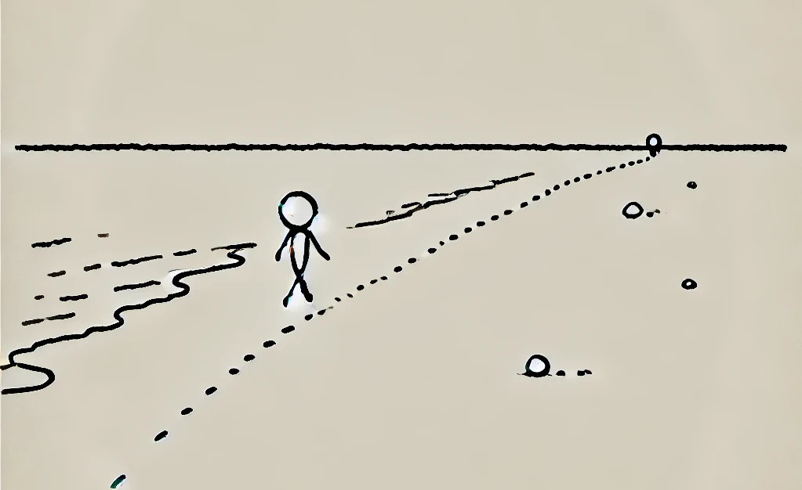

# hammerdirt Reporter

The reporter is an implementation of llms and ML pipelines to report beach litter surveys. 

## Submission to the prtotype fund

1. [Sustainable digitalization and digital sufficiency ](https://prototypefund.opendata.ch/fr/a-propos/prototypes-pour-la-transformation-systemique/)

## References and resources:

**The trash along lakes and rivers** is an official theme of Swiss Federal Office of The Environment:
1. https://www.bafu.admin.ch/bafu/fr/home/themes/dechets/dossiers/des-dechets-aux-abords-des-lacs-et-cours-d-eau-suisses.html

__It is based on a lot of previous work:__

* [IQAASL](https://github.com/hammerdirt-analyst/IQAASL-End-0f-Sampling-2021) : The federal report on trash along lakes and rivers
* [Reporting Volunteer Observations](https://hammerdirt-analyst.github.io/feb_2024/titlepage.html) : Methods for reporting volunteer observtions and the role of AI
* [Solid Waste Team EPFL](https://github.com/hammerdirt-analyst/solid-waste-team) : Predicting beach litter values with EPFL students
* [Rvealing the role of land use in macro litter distribution](https://www.sciencedirect.com/science/article/pii/S0269749124016257) : Peer review article on the role of land use in litter distribution
* [Plastock](https://associationsauvegardeleman.github.io/plastock/) : The results of 12 months of beach litter surveys on Lac Léman in 2022
* [Probability of trash](https://github.com/hammerdirt-analyst/finding-one-object) : The probability of finding one object on a beach, using conditional probability

## Way forward

We could use some help. There is currently no financing for this project. If you want to help contact the maintainer.

